```python
import pandas as pd
import numpy as np
import os
import glob
import datetime
import matplotlib.pyplot as plt
import seaborn as sns
import matplotlib
from pandas_profiling import ProfileReport
from picklib.data_handler import DataHandler
from picklib.data_analytics import DataAnalysis
from sklearn.ensemble import RandomForestRegressor, RandomForestClassifier
from picklib.modeller import *
#picklib - my small custom library for this task
```


```python
import pandas as pd
import numpy as np
import os
import glob
import datetime
from pyod.models.cblof import CBLOF


class DataHandler():
    def __init__(self):
        self.path_tocal_folder  = "data"
        self.path_local_data = "data2.csv"
        
    @staticmethod
    def str_to_datetime(date_string):
        if pd.isna(date_string) == False:
            y,m,d,t = date_string.split("-")
            try:
                h,mm,s,ms = t.split(".")
            except: 
                h,mm,s,ms = [0,0,0,0]
            return datetime.datetime(year = int(y), 
                                     month = int(m), 
                                     day = int(d), 
                                     hour = int(h), 
                                     minute = int(mm), 
                                     second = int(s),
                                     microsecond = int(ms))
        else:
            return None
        
    @staticmethod
    def to_datetime(df, columns = ['pick_start_date','pick_end_date']):
        for col in columns:
            df[col] = df[col].apply(datetime.datetime.fromisoformat)
        return df
        
    def get_data_filenames(self):
        self.data_path = os.path.join(os.getcwd(), self.path_tocal_folder)
        self.filenames = glob.glob(f'{self.data_path}/*.csv')
        
    def clean_data(self, df, drop = True):
        df.loc[:,"pick_start_date"] = df.pick_start_date.apply(self.str_to_datetime)
        df.loc[:, "pick_end_date"] = df.pick_end_date.apply(self.str_to_datetime)

        if drop:
            df.dropna(subset = ["pick_start_date","pick_end_date"], inplace = True)
            df = df[df.pick_start_date.apply(lambda x: x.year > 2000)]
            df = df[df.pick_end_date.apply(lambda x: x.year > 2000)]
        
        return df
    
    @staticmethod
    def feature_generate(df):
        df.loc[:,'pick_diff'] = df[['pick_start_date','pick_end_date']].apply(lambda x: x[1]- x[0] if any(pd.isna(x)==False) else None, axis = 1)
        df.loc[:,"pick_diff_microseconds"] = df.pick_diff.dt.microseconds
        df.loc[:,"pick_diff_seconds"] = df.pick_diff.dt.seconds
        df.loc[:,"pick_diff_seconds"] = df.loc[:,["pick_diff_microseconds","pick_diff_seconds"]].apply(lambda x: x[0]/1e+6+x[1], axis = 1)
        return df
    
    @staticmethod
    def select_df(df):
        df = df[df.pick_diff.dt.days == 0]
        return df
        
    def read_data(self, read = False):
        if read:
            self.get_data_filenames()
            dfs = []
            for filename in self.filenames:
                print(f"filename reading - {filename.split('/')[-1]}")
                df = pd.read_csv(filename, sep = ";")
                df = self.clean_data(df)
                df =  self.feature_generate(df)
                df =  self.select_df(df)
                dfs.append(df)
            self.data = pd.concat([df for df in dfs])
            self.data.drop(columns = 'Unnamed: 11', errors = "ignore", inplace = True)
            self.data.reset_index(inplace = True, drop = True)
            self.data.to_csv(os.path.join(os.getcwd(),"data2.csv"))
        else:
            self.data = pd.read_csv(os.path.join(os.getcwd(), self.path_local_data))
            self.data.drop(columns = "Unnamed: 0", inplace = True)
            self.data.pick_start_date = self.data.pick_start_date.apply(datetime.datetime.fromisoformat)
            self.data.pick_end_date = self.data.pick_end_date.apply(datetime.datetime.fromisoformat)
        print(f"Data row amount: {self.data.shape[0]}")
                      
                      
    def get_ids_amount(self, order_threshold = 1, art_threshold = 50, tour_threshold = 2, delete = True):
        self.data = pd.merge(  self.data, 
                             self.data.los_order_id.value_counts().reset_index(name = "pick_amount_in_order").rename(columns = {"index":"los_order_id"}),
                             on = "los_order_id")


        self.data = pd.merge(  self.data, 
                             self.data.art_id.value_counts().reset_index(name = "art_amount").rename(columns = {"index":"art_id"}),
                             on = "art_id")

        self.data = pd.merge(  self.data, 
                             self.data.tour_id.value_counts().reset_index(name = "tour_amount").rename(columns = {"index":"tour_id"}),
                             on = "tour_id")

        if delete:
            #set -1 value for orders with one pick
            self.data.loc[self.data.pick_amount_in_order ==  order_threshold ,"los_order_id"] = -1
            self.data.loc[self.data.tour_amount <= tour_threshold,"tour_id"] = -1
            self.data.loc[self.data.art_amount <= art_threshold  ,"art_id"] = -1
                      
                      
    def feature_generating(self):
        #delete unique id
        self.get_ids_amount()

#         #Count serial pick number in order
#         self.data.sort_values(["los_order_id","pick_start_date"], inplace = True)
#         self.data.loc[:, "pick_id_serial_number"] = self.data.groupby("los_order_id").los_pick_id.apply(lambda x: 
#                                                                                                     list(range(1, len(x)+1))).sum()

#         self.data.loc[self.data.los_order_id == -1,"pick_id_serial_number"] = -1

        #dencity count
        self.data.loc[:,"volume_weight_product"] = self.data[["volume","weight"]].apply(lambda x: np.round(x[0]*x[1]), axis = 1)

        
    def outliers_detect(self, columns,outliers_fraction = 0.05):
        X = pd.get_dummies(self.data[columns])
        clf = CBLOF(contamination=outliers_fraction,check_estimator=False, random_state=0)
        clf.fit(X)
        scores_pred = clf.decision_function(X) * -1
        y_pred = clf.predict(X)
        self.data['outlier'] = y_pred.tolist()
        n_inliers = len(y_pred) - np.count_nonzero(y_pred)
        n_outliers = np.count_nonzero(y_pred == 1)        
```

<h6>Read data from files:</h6>


```python
DH = DataHandler()
DH.get_data_filenames()
DH.read_data(read = False)
DH.data.head()
```

    Data row amount: 10801367


<div>
<style scoped>
    .dataframe tbody tr th:only-of-type {
        vertical-align: middle;
    }

    .dataframe tbody tr th {
        vertical-align: top;
    }

    .dataframe thead th {
        text-align: right;
    }
</style>
<table border="1" class="dataframe">
  <thead>
    <tr style="text-align: right;">
      <th></th>
      <th>los_pick_id</th>
      <th>los_order_id</th>
      <th>art_id</th>
      <th>to_pick</th>
      <th>weight</th>
      <th>volume</th>
      <th>tour_id</th>
      <th>box_position_on_cart</th>
      <th>box_type</th>
      <th>pick_start_date</th>
      <th>pick_end_date</th>
      <th>pick_diff</th>
      <th>pick_diff_microseconds</th>
      <th>pick_diff_seconds</th>
    </tr>
  </thead>
  <tbody>
    <tr>
      <th>0</th>
      <td>25075296</td>
      <td>2135904.0</td>
      <td>597118.0</td>
      <td>1.0</td>
      <td>0.374</td>
      <td>1015.20</td>
      <td>272485.0</td>
      <td>1.0</td>
      <td>onePos_LX</td>
      <td>2019-11-25 19:35:06.182465</td>
      <td>2019-11-25 19:35:11.423183</td>
      <td>0 days 00:00:05.240718000</td>
      <td>240718</td>
      <td>5.240718</td>
    </tr>
    <tr>
      <th>1</th>
      <td>25075305</td>
      <td>2135905.0</td>
      <td>626271.0</td>
      <td>1.0</td>
      <td>0.120</td>
      <td>284.46</td>
      <td>272379.0</td>
      <td>20.0</td>
      <td>ROT</td>
      <td>2019-11-25 18:43:44.468017</td>
      <td>2019-11-25 18:43:50.178721</td>
      <td>0 days 00:00:05.710704000</td>
      <td>710704</td>
      <td>5.710704</td>
    </tr>
    <tr>
      <th>2</th>
      <td>25075304</td>
      <td>2135905.0</td>
      <td>390429.0</td>
      <td>1.0</td>
      <td>0.488</td>
      <td>913.92</td>
      <td>272379.0</td>
      <td>20.0</td>
      <td>ROT</td>
      <td>2019-11-25 18:22:26.543990</td>
      <td>2019-11-25 18:22:31.027626</td>
      <td>0 days 00:00:04.483636000</td>
      <td>483636</td>
      <td>4.483636</td>
    </tr>
    <tr>
      <th>3</th>
      <td>25075307</td>
      <td>2135905.0</td>
      <td>275727.0</td>
      <td>1.0</td>
      <td>0.330</td>
      <td>710.50</td>
      <td>272379.0</td>
      <td>20.0</td>
      <td>ROT</td>
      <td>2019-11-25 17:25:52.419095</td>
      <td>2019-11-25 17:25:55.932441</td>
      <td>0 days 00:00:03.513346000</td>
      <td>513346</td>
      <td>3.513346</td>
    </tr>
    <tr>
      <th>4</th>
      <td>25075306</td>
      <td>2135905.0</td>
      <td>629205.0</td>
      <td>1.0</td>
      <td>0.056</td>
      <td>307.20</td>
      <td>272379.0</td>
      <td>20.0</td>
      <td>ROT</td>
      <td>2019-11-25 18:43:15.705205</td>
      <td>2019-11-25 18:43:16.596565</td>
      <td>0 days 00:00:00.891360000</td>
      <td>891360</td>
      <td>0.891360</td>
    </tr>
  </tbody>
</table>
</div>


<h6>Generates profile reports using pandas_profiling:</h6>
<p>(all results are saved at profile_report.html)


```python
#I do not select all rows to make it faster
profile = Profi leReport(DH.data.drop(columns = ["los_pick_id","pick_start_date","pick_end_date","pick_diff"]), title='Pandas Profiling Report')
profile.to_file("profile_report.html")
profile.to_widgets()
```


    HBox(children=(FloatProgress(value=0.0, description='variables', max=10.0, style=ProgressStyle(description_wid…


    


    HBox(children=(FloatProgress(value=0.0, description='correlations', max=6.0, style=ProgressStyle(description_w…


    


    HBox(children=(FloatProgress(value=0.0, description='interactions [continuous]', max=81.0, style=ProgressStyle…


    


    HBox(children=(FloatProgress(value=0.0, description='table', max=1.0, style=ProgressStyle(description_width='i…


    


    HBox(children=(FloatProgress(value=0.0, description='missing', max=2.0, style=ProgressStyle(description_width=…


    


    HBox(children=(FloatProgress(value=0.0, description='warnings', max=3.0, style=ProgressStyle(description_width…


    


    HBox(children=(FloatProgress(value=0.0, description='package', max=1.0, style=ProgressStyle(description_width=…


    


    HBox(children=(FloatProgress(value=0.0, description='build report structure', max=1.0, style=ProgressStyle(des…


    


Based on results at profile_report.html:
- tour_id is highly correlated with los_order_id	
- los_order_id is highly correlated with tour_id	

**Generate some basic features:**


```python
DH.feature_generating()
```

**Target value:** pick_diff_seconds (difference between pick_end_date and  pick_start_date)


```python
DH.data['pick_diff_seconds'].describe()
```


    count    1.080137e+07
    mean     9.661779e+00
    std      6.704275e+01
    min      5.243800e-02
    25%      2.743618e+00
    50%      4.889462e+00
    75%      1.020770e+01
    max      5.937141e+04
    Name: pick_diff_seconds, dtype: float64


Plot target value destribution:


```python
DH.data.pick_diff_seconds.apply(int).value_counts().reset_index(name = "amount").rename(columns = 
                                                                             {"index":"pick_diff_seconds"}).plot.scatter(x = "pick_diff_seconds", y = "amount")
```


    <matplotlib.axes._subplots.AxesSubplot at 0x7fcc133ef890>


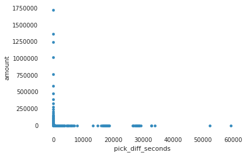


```python
plt.scatter(DH.data.pick_start_date, DH.data['pick_diff_seconds'].values)
plt.xlabel('index')
plt.ylabel('Pick time')
plt.title("Sales distribution")
sns.despine()
```


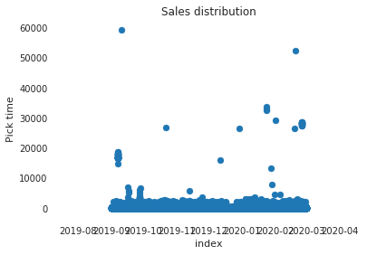


As we can see on the plot, there are some outbursts. Maybe it is worth deleting all the data, where pick time is twice higher than mean value, but first we need to look deeper.

<h5>Plot target value destribution grouped by features,using custom lib:</h5>


```python
class DataAnalysis():
    def __init__(self,df):
        self.df = df
        self.target_col = "pick_diff_seconds"
        self.top_values = 10
        
    def get_corr(self, columns = ["pick_diff_seconds","to_pick","weight","volume","tour_id","art_id","box_position_on_cart","box_type"]):
        df = pd.get_dummies(self.df[columns])
        return df.corr()[[self.target_col]].sort_values(by = self.target_col, ascending = False)    

    def hist_plot_groupby(self, group_col, mean = True, median = False):
        if mean:
            print(f"Mean hist plot grouped by: {group_col}")
            data = self.df.groupby(group_col)[self.target_col].mean().sort_index(ascending = True)
            data = pd.concat([data.head(self.top_values), data.tail(self.top_values)]).drop_duplicates()
            return data.plot.bar()
        if median:
            print(f"Median hist plot grouped by: {group_col}")
            data = self.df.groupby(group_col)[self.target_col].median().sort_index(ascending = True)
            data = pd.concat([data.head(self.top_values), data.tail(self.top_values)]).drop_duplicates()
            return data.plot.bar()
        
    @staticmethod  
    def pie_chart_with_groups (dataset, categories, segments, title = ""):
        dataset = dataset[dataset[segments].isna() == False]
        for i in tuple(dataset[segments].unique()):
           # for k in ["New","Regular"]:

            df = dataset[(dataset[segments] == i) & (dataset[segments].isna()==False)]
        # Draw Plot
            fig, ax = plt.subplots(figsize=(12, 7), subplot_kw=dict(aspect="equal"), dpi= 80)

            data = df[df[categories].isna()==False].groupby(categories).size().reset_index(name = "amount").amount
    #         cats = df.loc[df[categories].isna()==False,categories]
            cats = list(set(df[categories]))
            #explode = [0,0,0,0,0,0.1,0]

            def func(pct, allvals):
                return "{:.1f}% )".format(pct)

            wedges, texts, autotexts = ax.pie(data,radius=1.2, 
                                              autopct=lambda pct: func(pct, data),
                                              textprops=dict(color="w"), 
                                              colors=plt.cm.Dark2.colors,
                                             startangle=230)

            # Decoration
            ax.legend(wedges,cats , title=categories, loc="center left", bbox_to_anchor=(1, 0, 0.5, 1),fontsize =17)
            plt.setp(autotexts, size=12, weight=50)
            ax.set_title(title+str(i), size = 15)
            plt.xlabel("amount - " + str(data.sum()),size = 15)
            plt.show()  
       
    @staticmethod
    def compute_histogram_bins(data, desired_bin_size):
        min_val = np.min(data)
        max_val = np.max(data)
        min_boundary = min_val#-1.0 * (min_val % desired_bin_size - min_val)
        max_boundary = max_val - max_val % desired_bin_size + desired_bin_size
        n_bins = int((max_boundary - min_boundary) / desired_bin_size) + 1
        bins = np.arange(min_boundary, max_boundary, n_bins)
        return bins

    @staticmethod
    def hist_plot(df, column,  desired_bin_size):
        if desired_bin_size != 0:
            b = compute_histogram_bins(df.loc[df[column].isna() ==False,column],1)

            plt.hist(df.loc[df[column].isna() ==False,column], 
                 bins = b)
        else :
                plt.hist(df.loc[df[column].isna() ==False,column])
                plt.ylabel('Amount')
                plt.xticks(rotation='vertical')
                plt.xlabel(column)
```

**box_type:**


```python
#box type median target value
DA = DataAnalysis(DH.data)
DA.hist_plot_groupby(group_col ="box_type", median = True, mean = False)
```

    Median hist plot grouped by: box_type


    <matplotlib.axes._subplots.AxesSubplot at 0x7fa8d87a7c50>


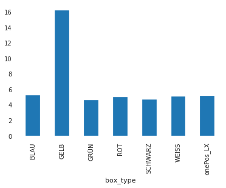


**to_pick:**

So, as we see, there is box type GELB, that required much more time to pick than other


```python
DA.hist_plot_groupby(group_col ="to_pick", median = True, mean = False)
```

    Median hist plot grouped by: to_pick


    <matplotlib.axes._subplots.AxesSubplot at 0x7fcbbc45bb50>


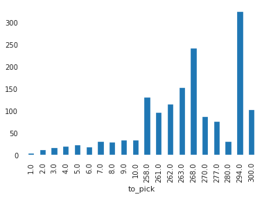


There is high dependency.

**tour_id:**


```python
#tour_id median target value
DA.hist_plot_groupby(group_col = "tour_id", median = True, mean = False)
```

    Median hist plot grouped by: tour_id


    <matplotlib.axes._subplots.AxesSubplot at 0x7fcba214dad0>


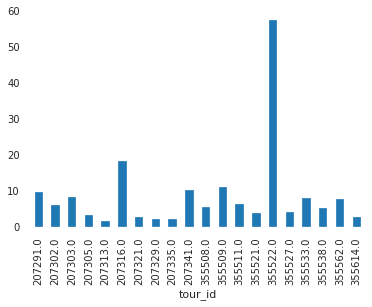


Picking time can also depends from tour_id

**volume:**


```python
DA.df.loc[:,"volume"] = DA.df["volume"].apply(np.round)
DA.hist_plot_groupby(group_col = "volume", median = True, mean = False)
```

    Median hist plot grouped by: volume


    <matplotlib.axes._subplots.AxesSubplot at 0x7fcb987c9290>


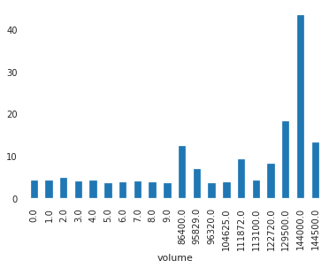


**weight:**


```python
DA.df.loc[:,"weight"] = DA.df["weight"].apply(np.round)
DA.hist_plot_groupby(group_col = "weight", median = True, mean = False)
```

    Median hist plot grouped by: weight


    <matplotlib.axes._subplots.AxesSubplot at 0x7fcbb1b96350>


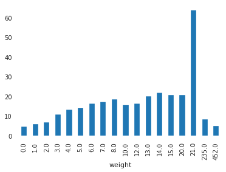


```python
DA.hist_plot_groupby(group_col = "weight", median = False, mean = True)
```

    Mean hist plot grouped by: weight


    <matplotlib.axes._subplots.AxesSubplot at 0x7fcbdc93f2d0>


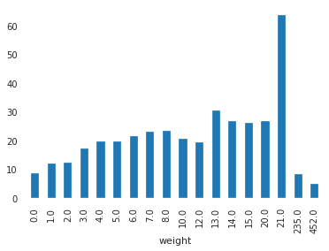


There is a trend: more weight and volume - more time to pick (but it does not work for the last to values). So, I think it worth counting  product of volume and weight.


```python
#Volume and weight product to consider dependences
DH.data["volume_weight_product"] = DH.data[["volume","weight"]].apply(lambda x: np.round(x[0]*x[1]), axis = 1)
DA.df["volume_weight_product"] = DA.df[["volume","weight"]].apply(lambda x: np.round(x[0]*x[1]), axis = 1)
DA.hist_plot_groupby(group_col = "volume_weight_product", median = True, mean = False)
```

    Median hist plot grouped by: volume_weight_product


    <matplotlib.axes._subplots.AxesSubplot at 0x7fcb8c525f10>


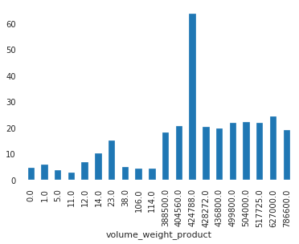


```python
sns.regplot(y="pick_diff_seconds", x="volume_weight_product", data=DH.data[DH.data.pick_diff_seconds < 30*60])
sns.despine()
```


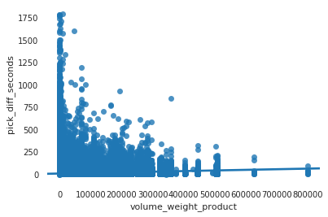


**box_position_on_cart:**


```python
#tour_id median target value
DA.hist_plot_groupby(group_col = "box_position_on_cart", median = True, mean = False)
```

    Median hist plot grouped by: box_position_on_cart


    <matplotlib.axes._subplots.AxesSubplot at 0x7fcba261ab90>


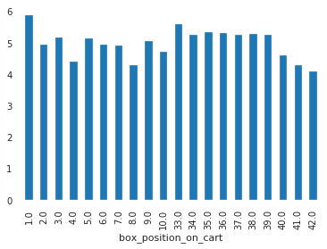


**Pick time destribution, splited by intervals:**


```python
#Split time to intervals
intervals = pd.IntervalIndex.from_tuples([(0,2),(2, 3),(3,4),(4, 6),(6,9), (9,13),(13,20), (20, 60), (60,600),(600, DH.data.pick_diff_seconds.max()//10*10)])
print(f'Outbursts interval: {intervals[-1]}')
DH.data['pick_diff_intervals'] = pd.cut(DH.data.pick_diff_seconds, bins = intervals)
DH.data['pick_diff_intervals'].value_counts().sort_index().plot.bar()
```

    Outbursts interval: (600.0, 59370.0]


    <matplotlib.axes._subplots.AxesSubplot at 0x7fa8fd4450d0>


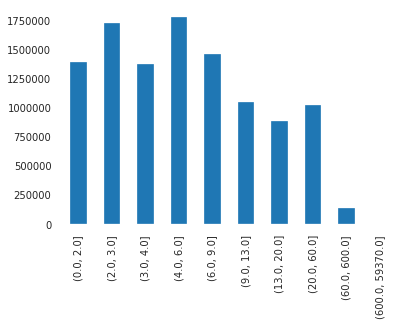


**Detect outliers:**


```python
DH.outliers_detect(columns = ['los_order_id', 'art_id', 'to_pick', 'weight', 'volume',
                               'tour_id', 'box_position_on_cart', 'box_type', 'pick_amount_in_order', 'art_amount',
                               'tour_amount', 'volume_weight_product'])
```


```python
rs = 55
colormap = np.array(['lightblue', 'r'])
plt.scatter(DH.data.sample(10000,random_state =rs ).pick_diff_seconds, DH.data.sample(10000,random_state =rs ).volume_weight_product, s=100, c=colormap[DH.data.sample(10000,random_state =rs ).outlier],
           alpha=0.25)
```


    <matplotlib.collections.PathCollection at 0x7fa8fb01c850>


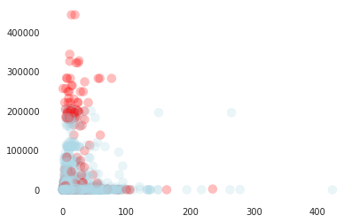


```python
plt.scatter(DH.data.sample(1000,random_state =rs ).pick_diff_seconds, DH.data.sample(1000,random_state =rs ).tour_id, s=100, c=colormap[DH.data.sample(1000,random_state =rs ).outlier],
           alpha=0.25)
```


    <matplotlib.collections.PathCollection at 0x7fa8fd439d10>


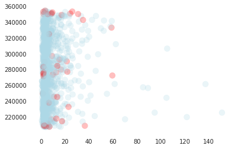


**Correlation with target value:**


```python
DA.get_corr(columns = ['los_pick_id', 'los_order_id', 'art_id', 'to_pick', 'weight', 'volume',
                        'tour_id', 'box_position_on_cart', 'box_type','pick_diff_seconds', 'volume_weight_product']).head(20)
```


<div>
<style scoped>
    .dataframe tbody tr th:only-of-type {
        vertical-align: middle;
    }

    .dataframe tbody tr th {
        vertical-align: top;
    }

    .dataframe thead th {
        text-align: right;
    }
</style>
<table border="1" class="dataframe">
  <thead>
    <tr style="text-align: right;">
      <th></th>
      <th>pick_diff_seconds</th>
    </tr>
  </thead>
  <tbody>
    <tr>
      <th>pick_diff_seconds</th>
      <td>1.000000</td>
    </tr>
    <tr>
      <th>to_pick</th>
      <td>0.099349</td>
    </tr>
    <tr>
      <th>weight</th>
      <td>0.033808</td>
    </tr>
    <tr>
      <th>volume</th>
      <td>0.030984</td>
    </tr>
    <tr>
      <th>volume_weight_product</th>
      <td>0.026859</td>
    </tr>
    <tr>
      <th>box_type_GELB</th>
      <td>0.023542</td>
    </tr>
    <tr>
      <th>box_position_on_cart</th>
      <td>0.014701</td>
    </tr>
    <tr>
      <th>box_type_WEISS</th>
      <td>0.006523</td>
    </tr>
    <tr>
      <th>los_order_id</th>
      <td>0.006135</td>
    </tr>
    <tr>
      <th>los_pick_id</th>
      <td>0.005842</td>
    </tr>
    <tr>
      <th>tour_id</th>
      <td>0.005344</td>
    </tr>
    <tr>
      <th>box_type_ROT</th>
      <td>0.005117</td>
    </tr>
    <tr>
      <th>box_type_BLAU</th>
      <td>0.005101</td>
    </tr>
    <tr>
      <th>art_id</th>
      <td>0.004783</td>
    </tr>
    <tr>
      <th>box_type_SCHWARZ</th>
      <td>0.002717</td>
    </tr>
    <tr>
      <th>box_type_GRÜN</th>
      <td>0.001849</td>
    </tr>
    <tr>
      <th>box_type_onePos_LX</th>
      <td>0.000288</td>
    </tr>
  </tbody>
</table>
</div>


**Apply RandomForest model:**


```python
def custom_accuracy(prediction, true, moe=1):
    score1 =  [1 if abs(t - p) < t*0.15 else 0 for p, t in zip(prediction, true) if t >20]
  
    score3 = [1 if abs(t - p) <= moe+1 else 0 for p, t in zip(prediction, true) if t >10 and p <=20]

    score2 =  [1 if abs(t - p) < moe else 0 for p, t in zip(prediction, true) if t <=10]

    return np.mean(sum([score1,score2, score3], []))*100

def accuracy(prediction, true, moe=0.1):
    return np.mean(
        [1 if t * (1 - moe) <= p <= t * (1 + moe) else 0
         for p, t in zip(prediction, true)]) * 100

def accuracy_(prediction, true, moe=0.1):
    return np.mean([1 if abs(t - p) < moe else 0 for p, t in zip(prediction, true)]) * 100


def MAPE(prediction, true):
    return np.mean(np.abs((true - prediction) / true)) * 100


def MedAPE(prediction, true):
    return np.median(np.abs((true - prediction) / true)) * 100

def feature_importance(model, features) -> pd.DataFrame:
    fi = pd.DataFrame(list(zip(model.feature_importances_, features)), columns = ['score','feature'])
    fi.set_index('feature', inplace=True)
    fi.sort_values('score', inplace=True)
    return fi

```


```python
class Modeller():
    def __init__(self, data):
        self.path_tocal_folder  = "data"
        self.data = data
        self.TARGET_COLUMN = "pick_diff_seconds"
        self.all_features = self.data.loc[:,self.data.columns != self.TARGET_COLUMN].columns
        
    def data_adapt(self):
        self.data['pick_start_date'] = self.data['pick_start_date'].dt.date
        self.data.drop(columns = 
                       ['pick_end_date', 'pick_diff', 'pick_diff_microseconds','pick_diff_intervals'], 
                       errors = "ignore",
                       inplace = True)
#         self.data['art'] = self.data.art_id.astype(object)
#         self.data.loc[self.data.art_id.isin(self.data.sort_values('art_amount').art_id.drop_duplicates().tail(100)),"top_art_id"] = self.data.loc[self.data.art_id.isin(self.data.sort_values('art_amount').art_id.drop_duplicates().tail(100)),"art_id"]
#         self.data.loc[self.data.tour_id.isin(self.data.sort_values('tour_amount').tour_id.drop_duplicates().tail(100)),"top_tour_id"] = self.data.loc[self.data.tour_id.isin(self.data.sort_values('tour_amount').tour_id.drop_duplicates().tail(100)),"tour_id"]
#         self.data["top_art_id"].fillna(-1,inplace = True)
#         self.data["top_tour_id"].fillna(-1,inplace = True)
#         self.data["top_art_id"] = self.data["top_art_id"].astype(object)
#         self.data["top_tour_id"] = self.data["top_tour_id"].astype(object)
        self.data = pd.get_dummies(self.data.set_index('pick_start_date'))
        self.data.reset_index(inplace = True)
        self.data.fillna(0, inplace = True)
        

    def split_data(self):
        unique_dates = self.data.pick_start_date.dt.date.drop_duplicates().sort_values()
        n_train_days = int(len(unique_dates)*0.7)
        train_dates = unique_dates[:int(n_train_days*0.7)].tolist()
        test_dates = unique_dates[int(n_train_days*0.7):].tolist()
        self.data_adapt()
        self.train = self.data[self.data.pick_start_date.isin(train_dates)]
        self.test = self.data[self.data.pick_start_date.isin(test_dates)]
        self.test.drop(columns = 'pick_start_date',inplace = True)
        self.train.drop(columns = 'pick_start_date',inplace = True)
        self.all_features = self.train.loc[:,self.train.columns != self.TARGET_COLUMN].columns

    def init_regression_model(self):
        self.regression_model = RandomForestRegressor(
            n_jobs=-1,
            n_estimators=300,
#             min_samples_split=2,
#             max_features=0.5
        )

    def fit_model_predict_prices_(self):
        self.init_regression_model()
        self.regression_model.fit(
            X=self.train[self.all_features],
            y=np.log(self.train[self.TARGET_COLUMN ]))
        self.predicted_time = np.exp(
            self.regression_model.predict(
                self.test[self.all_features]
            )
        )

    def scores(self, accuracy_type = 'custom_accuracy'):
        self.accuracy = []
        for moe in [0.1,1,1.5,2,3,5]:
            predictions = self.predicted_time
            true = self.test[self.TARGET_COLUMN].values
            accuracy_score = globals()[accuracy_type](predictions, true, moe=moe)
            self.accuracy.append((moe, accuracy_score))
            print(f'accuracy at {moe}: {accuracy_score}')
        self.mape = MAPE(predictions, true)
        self.medape = MedAPE(predictions, true)

        print(f'Validation accuracy: {self.accuracy}')
        print(f'Validation MAPE: {self.mape}')
        print(f'Validation MedAPE: {self.medape}')
```

We can use regular accuracy metric and count probability Of being predicted in 10% interval, but I thing we need custom metric. I reckon that there is no big differnce in this case between 1 s and 1.1s, but this accuracy so dificult to predict. Let's suppose that if time is less that 10s it is good to predict with 1+- interval. If predicted tome is more than 10s it is good to predict with 10% threshold.


```python
MD =  Modeller(data = DH.data.drop(columns = ["los_pick_id","date_encoded"], errors = "ignore").copy())
MD.split_data()
MD.fit_model_predict_prices_()
MD.scores()
```

    /usr/local/lib/python3.7/site-packages/pandas/core/frame.py:4117: SettingWithCopyWarning: 
    A value is trying to be set on a copy of a slice from a DataFrame
    
    See the caveats in the documentation: http://pandas.pydata.org/pandas-docs/stable/user_guide/indexing.html#returning-a-view-versus-a-copy
      errors=errors,


```python
feature_importance(MD.regression_model, MD.all_features).tail(10)
```

I applied Random Forest because i do not have a lot of time to apply more complicated model and feature engineering. Of course, we can also fit hyperparameters and test different models.Also is worth trying clastering, other anomaly detection methods and netural networks. But, I suppose, that the most important thing in this case is feature engineering not model fitting. 


```python

```


```python

```


```python

```
